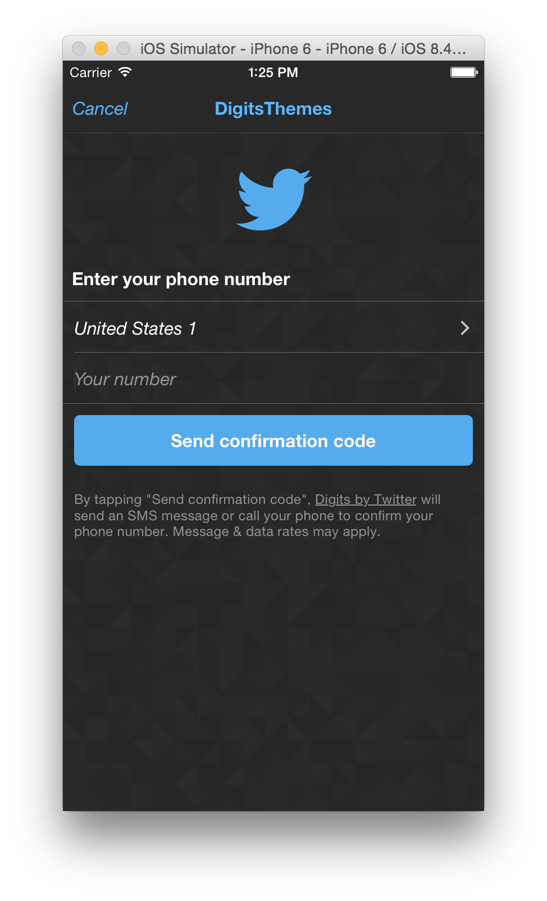

# Digits theming samples for iOS

This is a sample demonstrating [Digits](http://digits.com) authentication flow [theming] (http://docs.fabric.io/ios/digits/theming.html). Digits is available via [Fabric] (https://fabric.io).

## Getting Started	

To get started and run the app, you need to onboard it:

1. Sign up for [Fabric](https://fabric.io)
2. Download, install, and run the [Fabric Mac app] (https://fabric.io/downloads/xcode)
3. In Fabric.app, click "+ New App" and open DigitsThemes.xcworkspace
  * Install the Digits kit via a Podfile. When prompted, ignore the suggested pod snippets
4. In Xcode, open DigitsThemes.xcworkspace
  * Add the Run Script Build Phase from Fabric.app to the DigitsTheme target
  * Build the project
5. In Fabric.app, when prompted, ignore the suggested code snippets
6. In Xcode, run the project.  

## Project

The sample show how to set the following:

1. Logo
2. Label and Body fonts
3. Accent color
4. Background image

## Compatibility

This project was written in Swift 1.2 and on Xcode 6.4.

## License

Copyright 2015 Twitter, Inc.

Licensed under the Apache License, Version 2.0: http://www.apache.org/licenses/LICENSE-2.0
